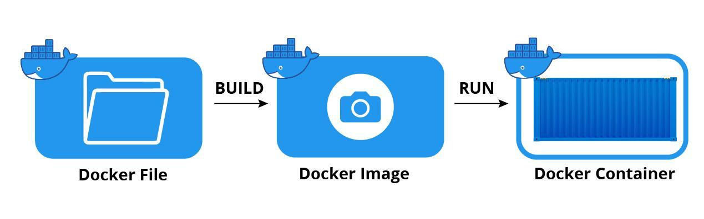
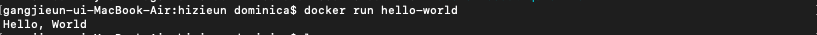

### 1. 컨테이너 기술?  
컨테이너는 어떤 환경에서나 실행하기 위해 필요한 모든 요소를 포함하는 소프트웨어 패키지입니다. 소프트웨어 서비스를 실행하는 데 필요한 특정 버전의 프로그래밍 언어 런타임 및 라이브러리와 같은 종속 항목과 애플리케이션 코드를 함께 포함하는 경량 패키지입니다. 컨테이너는 이러한 방식으로 운영체제를 가상화하며 프라이빗 데이터 센터에서 퍼블릭 클라우드 또는 개발자의 개인 노트북에 이르기까지 어디서나 실행됩니다.  


### 2. 도커?  
Go언어로 작성된 리눅스 컨테이너 기반으로 하는 오픈소스 가상화 플랫폼입니다. 다시 말해 특정한 서비스를 패키징하고 배포하는데 유용한 오픈소스 프로그램입니다. 컨테이너에는 라이브러리, 시스템 도구, 코드, 런타임 등 소프트웨어를 실행하는데 필요한 모든 것이 포함되어 있습니다.


### 3. 도커 파일, 도커 이미지, 도커 컨테이너의 개념 및 관계?  
도커 엔진에서 사용하는 기본 단위는 이미지와 컨테이너이며 도커 엔진의 핵심입니다. 도커 이미지와 컨테이너는 1:N 관계입니다.  
도커 파일은 도커 이미지를 만들때 사용합니다. docker build 명령어를 실행시키면 도커 이미지를 만들 수 있습니다.   
도커 이미지는 컨테이너를 생성할 때 필요한 요소이며, 가상 머신을 생성할 때 사용하는 iso 파일과 비슷한 개념입니다.    
도커 이미지를 docker run 명령어를 실행시키면 도커 컨테이너를 만들 수 있습니다. 도커 이미지는 도커 컨테이너를 생성하고 실행할 때 읽기 전용으로 사용되며 여러 계층으로 된 바이너리 파일로 존재합니다.  
도커 컨테이너는 도커 이미지로 생성할 수 있으며, 컨테이너를 생성하면 해당 이미지의 목적에 맞는 파일이 들어 있는, 호스트와 다른 컨테이너로부터 격리된 시스템 자원 및 네트워크를 사용할 수 있는 독립된 공간(프로세스)이 생성됩니다.
대부분의 도커 컨테이너는 생성될 때 사용된 도커 이미지의 종류에 따라 알맞은 설정과 파일을 가지고 있기 때문에 도커 이미지의 목적에 맞도록 사용되는 것이 일반적입니다.
컨테이너는 이미지를 읽기 전용으로 사용하되 이미지에서 변경된 사항만 컨테이너 계층에 저장하므로 컨테이너에서 무엇을 하든지 원래 이미지는 영향을 받지 않습니다. 또한 생성된 각 컨테이너는 각기 독립된 파일시스템을 제공받으며 호스트와 분리돼 있으므로 특정 컨테이너에서 어떤 어플리케이션을 설치하거나 삭제해도 다른 컨테이너와 호스트는 변화가 없습니다.
<p align="center"></p>  


### 4. 도커 설치 & 컨테이너 실행 시키기  
(1) 나의 사전 미션 폴더를 만들고 해당 폴더로 이동합니다.  
```
cd path/to/docker-pro-wanted/mission  
mkdir hizieun    
cd hizieun    
```
(2) "Hello, World!"를 출력하는 도커 파일을 만듭니다.
vim Dockerfile
i를 눌러 편집모드로 전환 후 아래 내용을 작성합니다:
```
FROM alpine:latest  
CMD ["echo", "Hello, World"]  
```
ESC를 눌러 명령모드로 전환 후, :wq 입력, enter키를 눌러 Dockerfile을 생성합니다.

(3) 도커 파일로 도커 이미지를 빌드합니다.  
```
docker build -t hello-world .  
```
(위 명령어의 의미는 "현재 디렉토리에서 Dockerfile을 읽어 도커 이미지를 만들고, 해당 이미지에 hello-world라는 tag 를 붙혀라" 입니다.)

(4) 빌드한 도커 이미지를 실행합니다.  
```
docker run hello-world  
```
이 명령어는 hello-world라는 이름의 도커 이미지를 실행시켜 "Hello, World!"를 출력합니다.
<p align="center"></p>   